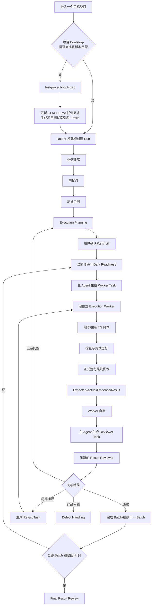

# 新版测试 Skill 改造计划

> 状态：Phase 0 至 Phase 4、Phase 6 的实现和验收通过；Phase 5 的并行与回归/恢复运行档案存在，但按当前 Final Review Contract 重验失败，需重新完成 Phase 5 验收；Phase 7 已按用户指示完成 Codex 与 Gemini 目录覆盖，Claude 目录未操作。
> 目标仓库：`C:\Users\17381\Desktop\测试全流程skill`
> 改造策略：直接升级当前版本，不保留旧执行契约兼容层；完成验收并经用户确认后，再覆盖同步到实际 Skill 安装目录。
> 本文是本轮改造的事实源。实施中若要改变冻结决策，必须先更新本文并说明理由，不能边改边改变架构。

### Phase 6 实施发现：Case Design → Planning 投影

正式 Router Run `PHASE6-RUNTIME-003` 证明当前 Case Contract 产出 `case_templates` / `execution_instances`，而 Execution Planning 与 Final Review 只消费顶层 `cases`；确认的 Case 文件直接交给 Planning 时会得到空 Case 集并拒绝。此为计划与现状的 producer-consumer 断点，不改变本计划冻结的业务规则或自动化栈决策。

最小修正：由 `test-case-design/scripts/case_contract.py` 提供确定性、不可手工编辑的 Runtime Case 投影；每个 `execution_instance` 生成独立 Runtime Case，Expected 只取该实例映射的断言，模板必须明确提供 `target_action`。Router、Execution Plan CLI、Final Review 均须从已绑定的原始 Case Design、Test Points、Business Model 重新严格校验并调用同一投影函数；Execution Plan 仍以完整 Case Design 文件 SHA-256 绑定确认版本。不新增旧格式 fallback，不在源 Case 文件中维护第二份可编辑 `cases` 真相。此投影是实现层的确定性规范化，不另设人工确认决策。Planning 中发现并修订上游 Case 时，Router 还需允许带原因返回 Case Design；重新注册新版 Case 后自动清除失效的下游计划/数据确认。

后续合同审查补充：`step` 与 `intermediate` Expected 必须绑定本 Case 内明确的 `step_id`，并原样进入 Runtime Plan；证据等级、录屏布尔值和 Expected 映射必须从机器可读 `evidence_policy` 投影，Planning 不得弱化。参数化模板的策略映射按每个实例实际承接的 Expected 过滤，同时确保每个必需证据断言至少进入一个实例；证据 kind 在 Case Contract 阶段枚举校验。Planning/Final Review 还必须分别验证 Router 注册的 Case 展示文件、合同文件、Review 文件和确认绑定的路径及 SHA-256 均当前一致。

Runtime 证据绑定补充：当 Planning 将 `runner_report` 列为某 Expected 的必需文件证据时，该 Expected 必须引用与 `automation_run.official_run.report_ref` 同一份官方 JSON 报告；只验证另一个独立的官方报告存在不足以满足逐 Expected 证据策略。

`runner_report` 只适用于自动化 Case；人工 Case 的必需证据不得要求官方自动化 Runner 报告。

截图执行校验补充：Planning `screenshots[].expected_ids` 中的每个 Expected 都必须在自己的结果行引用图像证据；中间检查点要按步骤时序采集，不能仅凭执行后的最终画面倒推先前状态。

### Phase 6 最终验收记录（2026-09-23）

- 正式 Router Run：`.phase6-forward/fresh-project/work/test-runs/PHASE6-RUNTIME-003`。B01 的 3 个冻结 Case（API 1、普通 UI 1、critical UI 1）由独立 Codex Execution Worker 执行、另一独立 Result Reviewer 复核；全部 Expected 与脚本、Runner 报告、截图/录屏完成 hash 绑定。Run 级 `test-result-review/scripts/final_review.py` 返回 `ok=true`、3 Cases、`conclusion=ready`；Router 已绑定真实 Final Review 文件并进入 `closed`。
- Contract 修正：Runtime 不再要求原样官方 Runner JSON 报告带 API 请求响应的 `redacted:true`；单独的 request/response JSON 仍必须声明脱敏。针对该边界的 Runtime Contract 验证为 15 passed。
- 全新 Claude Code 前向验收：Run `.phase6-forward/fresh-project/work/test-runs/PHASE6-CLAUDE-002`，主会话 UUID `78a70fb9-7812-490b-81a5-43ed2337357d`。主会话原始 stream 中记录到两次有序且不同类型的真实 Agent tool 调用与宿主完成事件：`test-execution-worker` Agent `a3b3b4bffbb1f6316` 完成后，才派发 `test-result-reviewer` Agent `a647bb808ce9de874`。Reviewer 独立确认 API/Vitest 与两条 UI/Playwright Case 全部 PASS；验证脚本先于首次 Case 运行、哈希一致、关键 UI 前后截图不同且录屏有效。
- 前向验收完整账本：`.phase6-forward/fresh-project/work/test-runs/PHASE6-CLAUDE-002/final-ledger.md`；实际 Agent 调用证据：`.phase6-forward/fresh-project/work/test-runs/PHASE6-CLAUDE-002/runner-results/claude-main-stream.jsonl`。所有本轮修改/运行均限于当前仓库隔离 fixture，未改真实业务项目或全局 Skill 安装目录。
- Phase 7 不在本次授权范围内：只有用户明确确认当前仓库版本满意并授权覆盖同步后，才可修改全局 Skill 安装目录。

### Phase 0–6 独立复核与修正（2026-09-24）

- 全量 `python -m pytest -q`：91 passed、1 skipped（Windows 未授予创建文件 symlink 的权限；目录 junction 用例通过）；Phase 6 正式 Router Run 经 `workspace_validate.py` 返回 `ok=true, issues=[]`，当前 `final_review.py` 重验 3 个 Case 得到 `conclusion=ready`。
- Phase 4 局部 Retest 实际证据位于 `.phase3-smoke/project-20260923-145036-374957/work/test-runs/PHASE4-RUNTIME-SMOKE`，包含新 Worker、自审、独立 Reviewer 和结果哈希绑定。
- Phase 5 两个历史 Run 确有并行 Batch、PASS_AFTER_FIX 和 BLOCKED 恢复链路，但二者当前 Final Review 都因 Router 缺少 `test_cases_self_review_passed` / `test_cases_confirmed` 标记而拒绝；旧状态中的 `closed/passed` 不替代当前 Contract 复核。历史 Run 保持原样，Phase 5 需用当前 Contract 重新验收。
- Bootstrap 安全修正：写入前整体检查 Agent/TypeScript 公共骨架及 `.test-workflow` 索引/配置目标；拒绝 symlink/junction 和普通文件祖先路径，拒绝非本工具归属标记或不完整配置，也拒绝新项目已有非本 Skill 文件、索引/profile 或升级时本地修改的受管文件。仅接受明确标记为 `test-project-bootstrap` 的新版 Profile；无标记旧 Profile 不迁移、不覆盖，遵循不保留旧执行契约兼容层的冻结决策。补充归属标记篡改、旧 Profile 拒绝、后置冲突预检、普通文件父路径及链接测试；一般磁盘/权限等写入期故障不承诺跨文件事务回滚。
- Phase 0–6 独立复核阶段未修改全局 Skill 安装目录或真实业务项目；Phase 7 的 Codex/Gemini 覆盖见下方记录。

### Phase 7 Codex/Gemini 覆盖记录（2026-09-24）

- 按用户明确指示，将仓库内 10 个 Skill 镜像覆盖至 `C:\Users\17381\.codex\skills` 与 `C:\Users\17381\.gemini\config\skills`；Claude 目录未修改。
- 覆盖前将两处目标中已存在的 8 个同名 Skill 分别备份至 `C:\Users\17381\Desktop\测试Skill全局覆盖备份-20260924\codex` 与 `...\gemini`，并逐文件校验备份 SHA-256。
- 覆盖后逐文件比对：Codex 99 个文件、Gemini 99 个文件，均为 0 缺失、0 多余、0 Hash 差异；Gemini `test-case-design` 目标端独有的旧 `__pycache__` 已在镜像中清理。其他不在本次范围内的 Skill 目录保持不变。

### Phase 7 只读目标目录盘点（2026-09-23）

只读检查发现本机有三个候选全局 Skill 根目录，计划没有指定其中哪一个作为 Phase 7 目标：

| 候选目录 | 当前目录数 | 本仓库 10 个 Skill 已存在 | 缺少 | 其他 Skill | 同名目录中哈希不同文件 | 源端有而目标没有 | 目标端独有文件 |
| --- | ---: | ---: | ---: | ---: | ---: | ---: | ---: |
| `C:\Users\17381\.claude\skills` | 62 | 8 | `test-point-design`、`test-project-bootstrap` | 54 | 34 | 26 | 0 |
| `C:\Users\17381\.agents\skills` | 61 | 6 | `test-defect-handling`、`test-execution-planning`、`test-point-design`、`test-project-bootstrap` | 55 | 29 | 24 | 0 |
| `C:\Users\17381\.codex\skills` | 69 | 8 | `test-point-design`、`test-project-bootstrap` | 61 | 32 | 26 | 0 |

对各候选目录中与仓库同名的 Skill 做了递归路径及 SHA-256 只读比较：所有同名目录都与仓库版本不同；没有发现目标同名 Skill 中存在仓库源目录没有的额外文件。未修改或删除上述任一全局文件。Phase 7 需要用户明确指定目标根目录、确认仓库版本可覆盖后，才能按计划执行镜像同步；不得将三个候选目录合并处理。

## 1. 这次改造要解决什么

当前流程对业务理解、测试点、测试用例、Batch、数据准备、结果账本和最终复核已有较完整的文件化契约，但执行阶段仍有四个核心问题：

1. `test-execution-runtime` 虽然文字要求“派 Worker、再派独立 Reviewer”，实际仍主要依赖主 Agent 自觉，Claude 容易不派子 Agent，直接自己执行并自己复核。
2. 执行方法只规定了“UI/API 怎么做”，没有把“必须先写脚本、试跑、修复、正式运行”的脚本生命周期写成强制契约。
3. API 和 UI 的 TypeScript 技术栈边界不够明确，容易误解成 API 也默认使用 Playwright。
4. 每个目标项目的 `CLAUDE.md`、资料目录、运行命令和环境入口不同，目前没有项目级初始化机制告诉 Agent 每次测试前必须先读什么。

本次改造后的直接结果应是：

- 自动化 Case 第一次执行也必须先写 TypeScript 脚本，再由脚本运行；禁止把临时 AI 点页面当正式执行。
- API Case 默认使用 `TypeScript + Vitest + Node.js 原生 fetch`。
- UI Case 默认使用 `TypeScript + Playwright Test`。
- 每个 Batch 必须由一个独立 Execution Worker 执行，再由另一个独立 Result Reviewer 复核。
- 并行执行两个 Batch 时，是两组 Worker；各 Batch 完成后再分别派自己的 Reviewer。逻辑上是两对角色，不是一个 Reviewer 混审所有正在变化的结果。
- 项目首次接入时先完成 Project Bootstrap，把测试规则索引写入项目 `CLAUDE.md` 的托管区块，并建立项目测试索引。
- Planning 必须在执行前决定每个 Case 的截图、录屏和其他证据要求。

## 2. 冻结决策

以下决策在本轮实施中直接执行，不再重新讨论。

### 2.1 脚本优先，不做 AI 直接执行模式

所有 `primary_execution=API` 或 `primary_execution=UI` 的 Case：

```text
读取用例、计划、数据和项目资料
→ 编写或更新 TypeScript 脚本
→ 类型检查/静态检查
→ 调试运行
→ 根据新增证据修脚本
→ 正式运行最终脚本
→ 生成结构化结果与证据
→ Worker 自审
→ 独立 Reviewer
```

禁止：

- 第一次执行先让 AI 直接点页面，回归时才补脚本；
- 用浏览器临时操作结果代替正式脚本运行；
- 调试运行成功后不做正式运行就判 PASS；
- 脚本最后修改后继续沿用修改前的报告或证据；
- 把运行器退出码为 0 当成 Case PASS。

人工 Case 仍可保留，但必须确实属于硬件、扫码、人工审批或主观视觉等无法稳定自动化的范围，不能因为 Agent 不会写脚本就改成人工。

### 2.2 API 和 UI 统一 TypeScript，不统一执行驱动

| 类型 | 语言 | 测试运行器 | 调用/操作方式 | 主要证据 |
|---|---|---|---|---|
| API | TypeScript | Vitest | Node.js 原生 `fetch`，通过项目内统一 API Client 封装 | 脱敏请求、响应、耗时、read-back、Vitest JSON/JUnit 报告 |
| UI | TypeScript | Playwright Test | Playwright `page`、locator、browser context | 关键截图、按计划录屏、必要 Trace/Network、Playwright JSON/HTML 报告 |
| UI 的辅助 API | TypeScript | Playwright Test | 仅在需要共享浏览器登录态时使用 `APIRequestContext`；否则复用统一 API Client | 数据准备或 read-back 证据 |

边界：

- TypeScript 是语言和类型层，不是 HTTP 客户端。
- 纯 API Case 不默认依赖 Playwright。
- `APIRequestContext` 只用于 UI 流程配套的数据准备、共享 Cookie 或结果回读。
- `Supertest` 只适用于直接加载 Node/Express/Koa 应用的进程内测试，不作为部署环境黑盒 API 测试默认方案。
- Python 继续用于现有 Router、Contract、Ledger 和编排控制脚本；本次不把控制平面重写成 TypeScript。
- 新增的业务测试脚本、API 数据构造脚本和 UI 测试脚本统一使用 TypeScript。

### 2.3 本版不接 Jev

本版先解决确定性脚本执行、角色隔离和证据闭环，不接 Jev 元素选择，也不加入动态 UI Action Policy。

以后若实验 Jev，只能作为 Locator/动作候选建议层，不能代替 Playwright 脚本、Expected 断言、独立 Reviewer 或 PASS/FAIL 裁决。当前只预留扩展说明，不实现接口。

### 2.4 Worker 和 Reviewer 是 Agent，不再拆成重复 Skill

保留：

- `test-execution-runtime`：Batch 执行阶段的编排 Skill；负责门禁、任务组装、派发、状态和结果合同。
- `test-result-review`：整个 Run 完成后的最终对账 Skill，不是单个 Batch Reviewer。

新增两个 Claude Agent 定义：

- `test-execution-worker`：只负责一个 Batch 的脚本研究、编写、调试、正式执行、证据和自审。
- `test-result-reviewer`：使用干净上下文，只复核一个已完成 Batch 的任务、脚本、报告、结果和证据。

不新增 `worker-skill`、`reviewer-skill`，避免 Skill 与 Agent 职责重复。

### 2.5 没有子 Agent 能力时必须停止

Runtime 进入正式执行后：

- 主 Agent 只能编排，不能代替 Worker 操作浏览器、发正式业务请求或填写 Case Result。
- 必须实际调用宿主提供的子 Agent/Task 能力创建 Worker。
- Worker 完成后必须创建新的 Reviewer，不能复用 Worker 会话。
- 如果宿主没有子 Agent 能力、达到并发上限或无法取得独立 Reviewer，返回明确的 `BLOCKED`/等待状态；不能悄悄降级为主 Agent 自己执行。

Python Contract 可以校验 Worker/Reviewer 回执、不同 session ID 和文件顺序，但无法仅凭文件证明宿主真的创建了子 Agent。因此最终验收还必须包含一次新 Claude 会话的行为验收，检查真实 Task/Agent 调用记录。

### 2.6 不保留旧执行契约兼容

- 新执行计划、Worker Task、Case Result 和 Reviewer Result 使用新的 `schema_version`。
- 验证器只接受新版结构，不保留旧字段 fallback。
- 已关闭旧 Run 只读保留。
- 尚未进入 Runtime 的活动 Run 重新生成 Execution Plan。
- 已进入旧 Runtime 的活动 Run 不做原地混合升级；新建新版 Run 或从已确认 Case 重新进入 Planning。
- 最终覆盖同步 Skill 时删除目标目录内已被新版移除的旧文件，不能只复制新增文件形成混合版本。

## 3. 新版整体流程



Project Bootstrap 是项目级前置动作，不是每个 Run 都重复的业务阶段，也不写入 `current_stage`。Router 每次只做轻量版本检查；只有缺失或版本漂移时才重新 Bootstrap。

## 4. 项目初始化与 `CLAUDE.md`

### 4.1 新增 `test-project-bootstrap`

新增第 10 个 Skill，但 Run 内仍保持原 9 个阶段 Skill。职责：

1. 定位真实项目根目录。
2. 读取现有 `CLAUDE.md` 和项目资料，不抹掉项目自己的构建、代码规范和安全要求。
3. 替换 `CLAUDE.md` 中唯一的测试流程托管区块；没有则追加。
4. 创建项目测试索引和机器 Profile。
5. 安装或更新 Claude 的 Worker/Reviewer Agent 定义。
6. 创建 TypeScript 自动化公共骨架，但不创建具体业务 Case 脚本。
7. 验证初始化结果，并记录版本与文件 Hash。

建议目标结构：

```text
<project>/
├─ CLAUDE.md
├─ .claude/
│  └─ agents/
│     ├─ test-execution-worker.md
│     └─ test-result-reviewer.md
├─ .test-workflow/
│  ├─ PROJECT_TESTING_INDEX.md
│  └─ project-profile.json
├─ work/
│  ├─ test-automation/
│  │  ├─ package.json
│  │  ├─ package-lock.json
│  │  ├─ tsconfig.json
│  │  ├─ vitest.config.ts
│  │  ├─ playwright.config.ts
│  │  └─ framework/
│  │     ├─ api-client.ts
│  │     ├─ evidence.ts
│  │     ├─ redaction.ts
│  │     └─ runtime-context.ts
│  └─ test-runs/
└─ ...项目原文件
```

具体 Case 脚本继续归当前 Run：

```text
work/test-runs/<RUN>/scripts/api/<BATCH>/<CASE>.test.ts
work/test-runs/<RUN>/scripts/ui/<BATCH>/<CASE>.spec.ts
```

公共运行框架在 `work/test-automation/`，Run 脚本通过配置或 CLI 指定路径执行。这样第一轮留下的脚本可用于同一 Run 的补测和回归，又不会把 Case 文件散落在项目根目录。

### 4.2 `CLAUDE.md` 只管理测试托管区块

即使本次不保留旧 Skill 兼容，也不能覆盖项目已有的业务/研发说明。Bootstrap 只替换：

```markdown
<!-- TEST-WORKFLOW:START -->
## AI 测试流程入口

- 开始或恢复测试前，必须先读 `.test-workflow/PROJECT_TESTING_INDEX.md`。
- 再读取当前 Run 的 `internal/state/run-status.json` 和 Router 给出的 `next_action`。
- 正式 Runtime 必须由主 Agent 派独立 `test-execution-worker`；Worker 完成后再派新的 `test-result-reviewer`。
- 自动化 UI/API Case 必须先写 TypeScript 脚本，再运行脚本；不得用临时交互代替正式执行。
- API 默认 Vitest + Node fetch；UI 默认 Playwright Test。
- 无法使用独立子 Agent 时停止并报告，不得由主 Agent 自演 Worker/Reviewer。
<!-- TEST-WORKFLOW:END -->
```

“直接覆盖”的含义是：托管区块、Agent 模板、自动化骨架和 Skill 契约按新版完全替换；不是删除项目自己的 `CLAUDE.md` 内容。

### 4.3 项目测试索引内容

`.test-workflow/PROJECT_TESTING_INDEX.md` 至少包含：

- 项目名称、根目录、技术栈；
- 需求、原型、业务文档、API 文档、数据库说明、源码入口；
- 现有测试与可复用脚本位置；
- 前后端启动、构建、Lint、类型检查和测试命令；
- Web/API 环境入口及环境标识；
- 账号角色与秘密引用位置，不写秘密值；
- 业务关键模块、状态/流程资料索引；
- 高风险/不可逆操作；
- 推荐调查顺序；
- 缺失资料与待确认项；
- `workflow_version`、更新时间和来源 Hash。

索引不是把所有资料复制一遍，而是告诉 Agent“遇到什么问题去看哪里”。每个阶段仍只加载与当前任务相关的资料。

### 4.4 触发时机

Router 在以下时机先路由到 Bootstrap：

- 目标项目第一次接入测试流程；
- `.test-workflow/project-profile.json` 缺失；
- `workflow_version` 与当前 Skill 包不一致；
- `CLAUDE.md` 托管区块缺失或 Hash 不一致；
- 用户明确要求刷新项目测试索引。

不会因为普通源代码变化每次重写 `CLAUDE.md`。源码或文档目录变化只触发索引增量刷新。

## 5. Execution Planning 改造

### 5.1 新版 Case 执行字段

每个自动化 Case 增加：

```json
{
  "automation": {
    "required": true,
    "language": "typescript",
    "runner": "vitest",
    "driver": "node-native-fetch",
    "script_target": "scripts/api/B01/TC-API-001.test.ts",
    "script_strategy": "create_or_update"
  }
}
```

UI Case：

```json
{
  "automation": {
    "required": true,
    "language": "typescript",
    "runner": "playwright-test",
    "driver": "playwright-page",
    "script_target": "scripts/ui/B02/TC-UI-001.spec.ts",
    "script_strategy": "create_or_update"
  }
}
```

强制映射：

- `primary_execution=API` → `runner=vitest`、`driver=node-native-fetch`。
- `primary_execution=UI` → `runner=playwright-test`、`driver=playwright-page`。
- `primary_execution=人工` → `automation.required=false`，并明确人工步骤与回填方式。
- API Case 使用 Playwright `APIRequestContext` 作为主驱动时 Contract 直接拒绝。

### 5.2 证据等级

Planning 对每个 Case 明确：

```json
{
  "evidence_plan": {
    "level": "standard",
    "screenshots": [],
    "recording": false,
    "api": [{"kind":"request_response","expected_ids":["E1"],"redacted":true}],
    "network": [],
    "files": [],
    "read_back_required": false
  }
}
```

证据列表项均使用 `kind` 与 `expected_ids` 绑定到具体 Expected；API 请求/响应项还必须声明 `redacted: true`。API Case 必须显式声明 `read_back_required`，为 true 时同时规划 `kind=read_back` 的 API 证据。录屏只接受 Case 级布尔值。

两档即可，不再增加复杂等级：

- `standard`：普通 UI Case 至少规划关键断言截图；API Case 保存 request/response 和必要 read-back。
- `critical`：核心 E2E、跨模块、跨角色、连续状态流或操作顺序重要的 UI Case，必须录屏，同时保留关键结果截图；视频不能替代断言截图。

本版录屏按 Case 级实现，不做 Batch 级长视频，避免多个 Case 共用视频造成定位、失败重跑和 Reviewer 对账困难。

Planning 自审增加：

- 自动化栈是否与 `primary_execution` 一致；
- 每个自动化 Case 是否有唯一 `script_target`；
- `critical` UI Case 是否同时有录屏与关键截图；
- 普通 UI Case 是否有关键截图；
- API Case 是否规划脱敏请求/响应及必要 read-back；
- 证据是否能对应具体 Expected，而不是笼统“截个图”。

## 6. Execution Worker 的强制执行协议

### 6.1 Worker 输入

`batch_task_builder.py` 生成的 Worker Task 必须包含：

- Batch、Case 顺序、原始步骤和 Expected；
- Planning 的自动化栈与 `script_target`；
- Data Manifest、账号/环境引用；
- 项目测试索引路径；
- 相关源码、API 文档、已有脚本候选路径；
- 证据计划；
- 允许和禁止修改范围；
- 正式运行输出目录；
- `task_id`、`schema_version`、任务 Hash。

### 6.2 Worker 的资料调查要求

Worker 写脚本前必须按问题需要交叉读取，而不是只看用例标题：

1. 已确认 Case、Execution Plan、Data Manifest；
2. 项目测试索引；
3. 对应业务/接口文档；
4. 相关源码、路由、组件、API Client 或已有测试；
5. 实际页面/接口的只读观察结果；
6. 只有出现冲突时才扩展到日志、Network 或更多源码。

Worker Result 记录实际使用的 `source_refs`。这不是要求机械读完整仓库，而是要求关键判断不能只有单一材料来源。

### 6.3 脚本生命周期

每个 Case 保存：

```text
script_created/updated
→ static_check
→ debug_run_1
→ diagnose
→ script_updated
→ debug_run_2
→ official_run
```

约束：

- 调试失败后再次运行，必须记录新增观察或脚本改动，禁止原样无限重试。
- 默认最多 3 轮无新增信息的调试尝试；仍不能推进则按真实原因返回 BLOCKED/NEEDS_REVIEW。
- 非幂等写操作不得盲目重试；先 read-back/reconcile，确认上一次动作是否已生效。
- 正式结果必须绑定最终脚本 SHA-256。
- 正式运行后若再改脚本，之前正式结果自动失效，必须重新正式运行。
- 调试运行只用于修脚本和识别环境/产品问题，不能直接产出 PASS。

### 6.4 API 脚本规范

API Case 必须：

- 使用公共 `api-client.ts` 封装的原生 `fetch`；
- 明确 method、URL、headers、body、timeout；
- 默认不自动重试 POST/PUT/PATCH/DELETE；
- 校验 HTTP 状态、业务状态和各 Expected；
- 必要时通过 GET/read-back 验证最终业务状态；
- 异步接口区分“已接受、处理中、完成/失败”；
- 输出脱敏后的 request/response、耗时和关联 ID；
- 不把 HTTP 200 单独作为 PASS。

如项目协议不是 HTTP（例如 WebSocket/gRPC），Planning 必须返回上游明确选择驱动；不能擅自伪装成普通 fetch Case。本轮先不实现这些额外驱动。

### 6.5 UI 脚本规范

UI Case 必须：

- 使用 Playwright Test；
- 优先 role、label、placeholder、test id 和业务唯一值定位；
- 表格先定位业务唯一行，再在行内操作；
- 页面变化、弹窗关闭、iframe/新窗口切换后重新定位；
- 使用可观察业务状态等待，避免固定长 sleep；
- 保存后按 Expected 继续验证列表、详情、刷新持久化或必要 read-back；
- 不以 Toast 单独证明完整业务成功；
- 按 Planning 输出截图/视频，失败时保留诊断 Trace；
- 不允许 AI 临时点击替代脚本动作。

### 6.6 Worker Result 新增脚本溯源

每个 Case Result 增加：

```json
{
  "automation_run": {
    "script_ref": "scripts/api/B01/TC-API-001.test.ts",
    "script_sha256": "...",
    "runner": "vitest",
    "driver": "node-native-fetch",
    "static_check": "passed",
    "debug_attempts": [],
    "official_run": {
      "run_id": "...",
      "started_at": "...",
      "finished_at": "...",
      "exit_code": 0,
      "report_ref": "evidence/B01/TC-API-001/runner/report.json",
      "script_sha256": "..."
    }
  }
}
```

Contract 必须校验：

- 脚本真实存在且位于当前 Run；
- 脚本扩展名与 runner 匹配；
- 最终脚本 Hash 与 official run 记录一致；
- runner 报告真实存在；
- Expected Evidence 位于当前 Run/Batch/Case；
- 计划录屏/截图真实存在；
- API/UI 计划与实际驱动一致；
- 技术错误没有伪装成产品 FAIL。

## 7. Worker/Reviewer 子 Agent 编排

### 7.1 每个 Batch 的角色数量

串行两个 Batch：

```text
B1 Worker → B1 Reviewer → B2 数据准备 → B2 Worker → B2 Reviewer
```

两个可并行 Batch：

```text
B1 Worker ─────────→ B1 Reviewer
B2 Worker ─────────→ B2 Reviewer
```

Reviewer 只能在对应 Worker 正式结果和自审完成后启动。若并发槽不足，排队，不降级成主 Agent。

### 7.2 派发与回执文件

新增：

```text
internal/execution/dispatch/
├─ B01-worker-task.json
├─ B01-worker-receipt.json
├─ B01-reviewer-task.json
└─ B01-reviewer-receipt.json
```

回执至少记录：

- `task_id`；
- `agent_role`；
- `agent_session_id`；
- `started_at` / `finished_at`；
- 输入 Task Hash；
- 输出文件及 Hash；
- 结果状态。

Reviewer Contract 拒绝：

- Reviewer 与 Worker 的 `agent_session_id` 相同；
- Reviewer Task 在 Worker 自审完成前生成；
- Reviewer 读取的是未冻结或 Hash 已变化的结果；
- Reviewer 未覆盖本 Batch 全部 Case；
- Reviewer 只根据 Worker 总结、没有读取脚本、报告和证据。

### 7.3 Reviewer 输入边界

Reviewer 读取：

- Batch Task 和 Execution Plan；
- 最终脚本及 Hash；
- runner 报告；
- Case Result；
- Expected 对应证据；
- Worker Self Review；
- 必要的错误日志。

Reviewer 不继承 Worker 对话和思维过程，不重新跑完整 Batch。证据不足时发局部 Retest Task；判断为上游设计/数据问题时明确返回对应阶段。

### 7.4 Retest 与 Regression

- Reviewer 要求的局部 Retest：生成只包含目标 Case 的新 Task，仍走脚本检查、正式运行、自审和新的 Reviewer。
- 产品修复后的 Regression：必须使用新的 Worker 会话；可以复用原脚本，但必须重新检查源码/环境变化并产生新的正式运行记录。
- Retest/Regression 不允许修改 Planning 的主执行方式和 Expected。

## 8. Router、Data Readiness、Defect、Final Review 的联动改造

### 8.1 Router

- Run 发现前先检查 Project Bootstrap 版本。
- `next_action=execute_batch` 时只能组装任务并派 Worker，主 Agent不能自行执行。
- 新增等待状态：`waiting_for_worker_slot`、`waiting_for_reviewer_slot`、`subagent_unavailable`。
- `current_stage` 仍只由 Router 改变。

### 8.2 Data Readiness

- 新建 API/UI 数据构造脚本统一 TypeScript。
- Data Manifest 增加 builder 的语言、runner、脚本 Hash 和 read-back 证据。
- 数据准备完成只授权当前 Batch，不授权后续 Batch。
- 非幂等准备失败先 reconcile，不盲目重建重复数据。

### 8.3 Defect Handling

- 只接受独立 Reviewer 确认的产品问题候选。
- Bug 复现引用最终脚本、脚本 Hash、正式运行和 Evidence。
- 修复回归使用新的 Worker session，并继续采用 API/Vitest 或 UI/Playwright 的原执行方式。
- 原 FAIL 历史保留，回归成功写 `PASS_AFTER_FIX`。

### 8.4 Final Result Review

Final Review 除现有账本对账外，新增检查：

- 所有自动化 Case 有正式脚本与 official run；
- 最终脚本 Hash 与结果绑定一致；
- 每个 Batch Worker/Reviewer 为不同 session；
- 录屏/截图要求完成；
- 无待处理 Retest/Regression；
- 没有主 Agent 代跑的降级标记；
- API/UI 技术栈没有偷换。

## 9. 文件级实施清单

### 9.1 新增

```text
test-project-bootstrap/
├─ SKILL.md
├─ agents/openai.yaml
├─ references/project-bootstrap-method.md
├─ assets/CLAUDE.testing-block.md
├─ assets/PROJECT_TESTING_INDEX.template.md
├─ assets/claude-agents/test-execution-worker.md
├─ assets/claude-agents/test-result-reviewer.md
├─ assets/typescript-runtime/...
└─ scripts/bootstrap_project.py

test-execution-runtime/references/typescript-api-contract.md
test-execution-runtime/references/typescript-ui-contract.md
test-execution-runtime/references/agent-dispatch-contract.md

tests/
├─ test_project_bootstrap.py
├─ test_execution_plan_v2.py
├─ test_runtime_script_contract.py
├─ test_agent_separation.py
└─ scenarios/...
```

### 9.2 修改

- `README.md`：改为“1 个项目 Bootstrap + 9 个 Run Skill”，更新总流程、技术栈和角色边界。
- `clarify-before-testing/SKILL.md`：增加 Bootstrap 前置检查和子 Agent 不可用时的明确停止规则。
- `clarify-before-testing/references/workflow-contract.md`：增加新版 schema 与派发状态。
- `clarify-before-testing/references/decision-and-resume.md`：恢复时重新校验脚本 Hash、Agent Task 和 official run。
- `clarify-before-testing/scripts/workflow_state.py`：接入 Bootstrap 状态和新版 Runtime next_action。
- `clarify-before-testing/scripts/workspace_validate.py`：允许并校验新增自动化/dispatch 目录。
- `test-execution-planning/SKILL.md`：加入 TypeScript、runner/driver、script target、证据等级。
- `test-execution-planning/references/execution-planning-method.md`：补脚本和录屏决策方法。
- `test-execution-planning/scripts/execution_plan.py`：实现 V2 强制映射和新 Evidence Contract。
- `test-data-readiness/SKILL.md`、`scripts/data_manifest.py`：新增 TypeScript builder 溯源。
- `test-execution-runtime/SKILL.md`：明确主 Agent 只编排、Worker/Reviewer 必须真实派发、脚本生命周期。
- `test-execution-runtime/references/runtime-worker-method.md`：拆分并链接 API/UI TypeScript 规范。
- `test-execution-runtime/references/runtime-review-method.md`：增加脚本与 official run 审查。
- `test-execution-runtime/scripts/batch_task_builder.py`：输出完整 Worker Task V2。
- `test-execution-runtime/scripts/execution_control.py`：校验脚本、Hash、runner report、证据和正式运行。
- `test-execution-runtime/scripts/reviewer_contract.py`：校验 Worker/Reviewer session 隔离和冻结输入。
- `test-execution-runtime/scripts/runtime_orchestrator.py`：加入 dispatch/receipt、等待状态和正式派发顺序。
- `test-execution-runtime/scripts/dashboard_update.py`、`dashboard.py`：展示脚本状态、调试/正式运行、Worker/Reviewer session、证据状态。
- `test-defect-handling/SKILL.md`、`scripts/defect_contract.py`：回归 Worker、脚本 Hash 和正式运行绑定。
- `test-result-review/SKILL.md`、`scripts/final_review.py`：全 Run 脚本与角色隔离对账。
- 所有受影响 `agents/openai.yaml`：说明新版职责，但不把完整流程重复塞进 UI 元数据。

### 9.3 删除或停止支持

- 旧 Execution Plan/Result 的兼容字段 fallback。
- API 主执行使用 Playwright 的默认路径。
- `scope=batch` 的录屏计划。
- 主 Agent 自己执行后再伪造 Worker/Reviewer 回执的描述性路径。
- 文档中任何“可以先直接操作、之后再补脚本”的表述。

## 10. 实施顺序

### Phase 0：冻结基线

- 记录当前 Git 状态和现有 Contract 行为。
- 建立 `schema_version=2` 和 `workflow_version` 常量。
- 先写失败的 Contract/场景测试，再改实现。

完成标准：旧契约样例被新版测试明确拒绝，新目标场景已有可执行测试骨架。

### Phase 1：Project Bootstrap

- 实现 `test-project-bootstrap`、托管区块更新、索引/Profile、Claude Agent 模板和 TypeScript 骨架。
- 验证首次初始化、二次幂等更新、保留项目原 `CLAUDE.md` 内容、版本漂移刷新。

完成标准：临时项目执行两次 Bootstrap，结果稳定；只替换托管区块，不破坏原项目说明。

### Phase 2：Planning V2

- 更新执行计划文档和 Contract。
- 强制 API/UI runner/driver 映射、`script_target` 和 Evidence 等级。

完成标准：错误技术栈、缺失脚本目标、critical UI 无视频/截图等样例全部被拒绝。

### Phase 3：TypeScript 自动化骨架

- 建立 API Client、Evidence、Redaction、Runtime Context。
- 建立 Vitest 和 Playwright 配置。
- 建立本地 mock API 和静态 UI smoke fixture。

完成标准：真实执行一条 API Case 和一条 UI Case，生成脚本、runner 报告、截图；critical UI 生成视频。

### Phase 4：Runtime 与 Agent 隔离

- 更新 Worker Task、脚本生命周期、official run 和 Case Result Contract。
- 增加 Worker/Reviewer dispatch 与 receipt。
- Reviewer 拒绝同 session、自审未完成、结果 Hash 漂移。

完成标准：单 Batch 完整链路和 Reviewer 局部 Retest 链路通过；主 Agent 无法通过合法命令跳过 Worker 或 Reviewer。

### Phase 5：跨阶段闭环

- 更新 Data Readiness、Defect、Regression、Dashboard、Final Review。
- 验证多 Batch、并行资格、回归解锁 BLOCKED Case 和最终关闭。

完成标准：原有关键闭环没有退化，新脚本/Agent 约束贯穿 producer → validator → finalizer → consumer。

### Phase 6：独立前向验收

- 在全新临时目标项目执行 Bootstrap。
- 用全新 Claude 会话跑一个含 API Batch、普通 UI Case、critical UI Case 的示例 Run。
- 人工确认 Claude 真实派发 Worker 和 Reviewer，而不是只生成回执文件。
- 检查 Agent 调用记录、证据文件、脚本 Hash、报告和最终账本。

完成标准：自动化 Contract 与真实 Agent 行为同时通过。只通过 Python 测试不能宣称改造完成。

### Phase 7：用户验收后覆盖同步

- 先列出当前仓库与安装目录差异。
- 用户确认本仓库版本满意后，将 10 个 Skill 目录按镜像方式覆盖到目标安装目录。
- 删除目标 Skill 目录中的旧残留文件。
- 对安装目录重新运行结构校验和关键场景测试。
- 不自动修改任何真实业务项目；Project Bootstrap 只在用户接入具体项目时运行。

## 11. 必须通过的验收场景

1. API Case 使用 `playwright-api-request-context` 作为主驱动时，Planning 拒绝。
2. API Case 使用 `typescript + vitest + node-native-fetch` 时，Planning 通过。
3. UI Case 使用 `typescript + playwright-test + playwright-page` 时，Planning 通过。
4. 普通 UI Case 未规划关键截图时拒绝。
5. critical UI Case 缺视频或关键截图任一项时拒绝。
6. 自动化 Case 没有 `script_target` 时拒绝。
7. Worker 没有最终脚本、静态检查或 official run 时不能提交 Case Result。
8. official run 的脚本 Hash 与当前脚本不一致时拒绝。
9. API runner report、UI runner report 或 Planned Evidence 文件不存在时拒绝。
10. HTTP 200 但业务 read-back 不满足 Expected 时不能 PASS。
11. Playwright 脚本只看到 Toast、没有验证要求的持久化结果时不能 PASS。
12. 技术/Locator/数据/环境错误不能登记为产品 FAIL。
13. Worker 和 Reviewer session 相同，Reviewer Contract 拒绝。
14. Reviewer 在 Worker 自审前启动，编排器拒绝。
15. Reviewer 发现单 Case 证据不足，只生成局部 Retest，不覆盖其他 Case 结果。
16. 两个 parallel-safe Batch 可以分别派 Worker；每个 Batch 后续有自己的 Reviewer。
17. 子 Agent 不可用时流程停在明确等待/阻塞状态，主 Agent不能代跑。
18. Regression 使用新的 Worker，会保留原 FAIL 并形成 `PASS_AFTER_FIX`。
19. 回归解锁的 BLOCKED Case 重新经过数据校验、Worker、Reviewer。
20. Bootstrap 首次创建、二次运行幂等、版本漂移更新，并保留 `CLAUDE.md` 非托管内容。
21. Final Review 在缺脚本、缺 agent receipt、缺录屏、存在 pending retest/resume 时拒绝关闭 Run。
22. 新 Claude 会话真实产生两个不同子 Agent 调用记录；仅有 JSON 中不同 ID 不算通过。

## 12. 完成定义

只有同时满足以下条件才能说改造完成：

- 文档、Schema、Python Contract、TypeScript 骨架和 Claude Agent 模板已联通；
- 新版结构验证全部通过；
- Python 语法/测试通过；
- TypeScript typecheck、Vitest API smoke、Playwright UI smoke 通过；
- 关键 22 个场景通过；
- 新 Claude 会话前向测试证明真实派发 Worker/Reviewer；
- 没有用自报字段代替真实行为验证；
- 用户审阅当前仓库版本并明确同意覆盖同步；
- 覆盖后的安装目录再次验证通过。

## 13. 实施过程的汇报方式

每完成一个 Phase，只汇报：

- 本阶段实际改了什么；
- 哪些验证通过；
- 哪些仍未完成；
- 是否改变了本文冻结决策；
- 下一阶段是什么。

不要用“文档已写”“测试数量很多”“脚本 exit 0”代替真实闭环结论。

## 附录 A：新对话启动提示词

```text
请在项目 `C:\Users\17381\Desktop\测试全流程skill` 中开始实施新版测试 Skill 改造。

唯一实施方案是：
`C:\Users\17381\Desktop\测试全流程skill\新版测试Skill改造计划.md`

要求：
1. 先完整读取计划、README、当前 9 个 Skill 及相关 Contract/编排脚本，再给我一个简短的现状核对和 Phase 0 执行清单；不要凭印象直接改。
2. 按计划 Phase 0 → Phase 6 在当前仓库实施。不要保留旧执行契约兼容层，不要修改冻结决策；发现计划与真实代码冲突时，先用证据说明，再更新计划或提出最小修正。
3. 这一版所有自动化 Case 都必须脚本优先：API 使用 TypeScript + Vitest + Node 原生 fetch；UI 使用 TypeScript + Playwright Test。禁止 API 默认走 Playwright，禁止 AI 临时操作代替正式脚本执行。
4. Runtime 必须明确由主 Agent 派独立 Execution Worker，Worker 完成并自审后，再派新的 Result Reviewer。主 Agent不得自演 Worker/Reviewer；如果当前环境无法使用子 Agent，直接说明阻塞，不要降级绕过。
5. 请实际使用子 Agent 协作实施和独立审查：把可独立的代码审查/测试任务派给子 Agent；最终由主 Agent对文件、测试和行为证据负责。不要让多个 Agent 同时编辑同一个文件。
6. 使用 apply_patch 修改文件，保护与本任务无关的现有改动。每个 Phase 完成后运行对应验证并汇报真实剩余边界。
7. 先只改当前仓库。未经我明确确认，不要同步或覆盖任何全局/用户安装目录中的 Skill，也不要改真实业务项目。
8. 不要把静态文档、伪造的 agent_session_id、单元测试全绿或 runner exit 0 当作完成；必须完成计划中的本地 API/UI smoke 和新 Claude 会话 Worker/Reviewer 前向行为验收。若最后一项需要我另开会话配合，明确停在该验收门前。

现在从 Phase 0 开始，不要一次性盲改全部文件。
```
